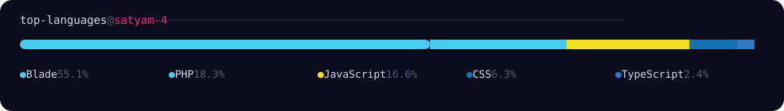

  <picture>
    <source media="(prefers-color-scheme: dark)" srcset="./assets/name-dark.png">
    <source media="(prefers-color-scheme: light)" srcset="./assets/name-light.png">
    
  </picture>

  
  
  
  

<h3 align="left">
  <code>about-me-and-tech-stack</code>
</h3>
> <code>Backend-focused developer working with <b>Node.js, Express, React, and Databases</b>. Currently sharpening <b>Core CS Fundamentals</b> and building scalable applications to solve real-world problems.</code>

 
 

<table>
  <tr>
    <td width="22%"><strong>Languages</strong></td>
    <td>
      
      
      
      
      
    </td>
  </tr>
  <tr>
    <td width="22%"><strong>Backend & Databases</strong></td>
    <td>
      
      
      
      
      
      
    </td>
  </tr>
  <tr>
    <td width="22%"><strong>Frontend</strong></td>
    <td>
      
      
      
      
      
      
      
    </td>
  </tr>
  <tr>
    <td width="22%"><strong>Tools & Infrastructure</strong></td>
    <td>
      
      
      
      
      
      
      
    </td>
  </tr>
</table>

<h3 align="left">
  <code>data-structures-and-algorithms</code>
</h3>
> <code>Practicing DSA consistently on <a href="https://leetcode.com/u/satyam-4/" target="_blank"><b>LeetCode</b></a></code>

 

  

<h3 align="left">
  <code>top-languages</code>
</h3>
> <code>Calculated dynamically from byte counts across public repositories.</code>

  

  

